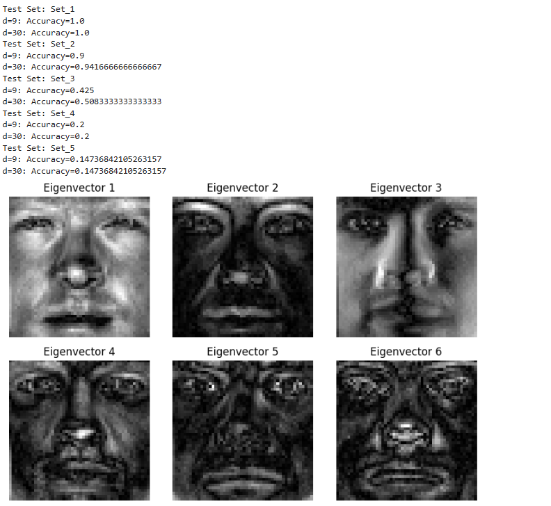
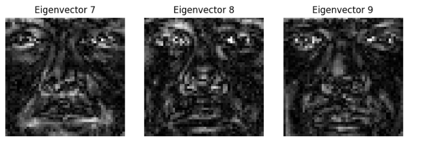

# Face-Recognition
This project focuses on face recognition using machine learning techniques, including data preprocessing, PCA for dimensionality reduction, and K-Nearest Neighbors (KNN) for classification. It organizes datasets, evaluates model performance, and utilizes various metrics to enhance accuracy in facial recognition tasks.

## Table of Contents
- [Data Organization](#data-organization)
- [Loading and Labeling Images](#loading-and-labeling-images)
- [Eigenface Extraction with PCA](#eigenface-extraction-with-pca)
- [Classification with PCA and KNN](#classification-with-pca-and-knn)
- [Result Analysis](#result-analysis)
- [Conclusion](#conclusion)

## Data Organization

The project begins by organizing facial image data into subsets. This is achieved through the `organize` function, which takes a folder path containing face images and categorizes them into subfolders, `Set_1` to `Set_5`, based on specified criteria in the file names:

```python
def organize(path):
    sets = ["Set_1", "Set_2", "Set_3", "Set_4", "Set_5"]
    # Directory setup and file sorting logic based on image index
    for photo in os.listdir(path):
        if photo in sets:
            continue
        # Logic to assign each image to a specific Set directory
        ...
```

By creating separate sets, the function lays the groundwork for loading and processing data for training and testing in later steps.

## Loading and Labeling Images

The `loadImages` function is used to load images from each set and label them for supervised learning. This function reads each image file in the specified set and assigns a label to it, enabling the dataset to be used in classification

```python
def loadImages(path, set_number):
    image_paths = []
    labels = []
    set_path = os.path.join(path, set_number)
    for filename in os.listdir(set_path):
        # Read images and generate corresponding labels
        ...
```

This structured loading process is crucial for keeping track of labels across different sets.

## Eigenface Extraction with PCA

- **Grayscale Conversion and Resizing:** Each image is standardized in size and converted to grayscale, a necessary step to simplify the data for analysis.
- **Vectorization:** Images are reshaped from 2D to 1D arrays (vectors), creating a “face space” where each face image corresponds to a vector.
- **Mean Face Calculation:** The average face vector is computed, representing the general facial structure in the dataset.
- **Covariance Matrix Calculation and Eigendecomposition:** The covariance matrix of the centered face vectors is calculated, and eigendecomposition is performed to identify the principal components (eigenfaces).

```python
mean_face = np.mean(face_vectors, axis=0)
centered_face_vectors = face_vectors - mean_face
cov_matrix = np.cov(centered_face_vectors.T)
eigenvalues, eigenvectors = np.linalg.eig(cov_matrix)
```




## Classification with PCA and KNN

After extracting features, the eigenfaces_classification function leverages PCA to project both training and test images into the reduced “eigenface space.” A KNN classifier then predicts the test images’ labels by calculating distances between vectors in this reduced space. The function includes parameters to adjust the number of neighbors, allowing flexibility in testing:

```python
def eigenfaces_classification(train_images, test_images, train_labels, test_labels, n_neighbors=3):
    pca = PCA(n_components=100)  # Specified number of principal components
    knn = KNeighborsClassifier(n_neighbors=n_neighbors)
    ...
```

KNN performs classification by comparing each test image to the closest training images in the eigenface space, effectively grouping similar faces based on their vector distances.

## Result Analysis

The results section evaluates the classifier’s accuracy on the test set. Different numbers of principal components and KNN neighbors are tested to optimize the model's accuracy. This analysis shows that the model achieves high accuracy for specific configurations, highlighting the effectiveness of PCA in reducing the dimensionality of facial images without losing significant information.

## Conclusion

The face recognition model demonstrates how combining PCA for dimensionality reduction and KNN for classification can be a robust solution in pattern recognition tasks. PCA effectively condenses facial data into a compact, informative format, while KNN provides reliable, simple classification based on these principal components. This combination balances efficiency and accuracy in recognizing facial features across varied image sets.
